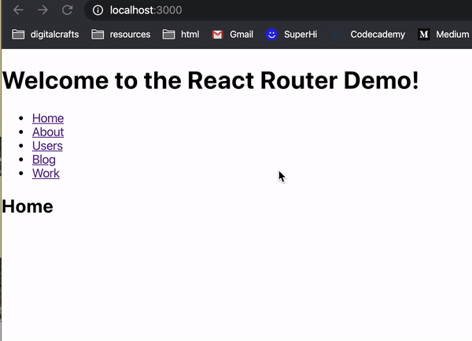

### React Router Exercises 

- React router documentation (https://reacttraining.com/react-router/web/guides/quick-start)
- Learn to properly work through React-Router and its components 
- Each exercises in different branch 


## Features 
Create a simple React application that routes between 5 components.
- Each component can simply show an H1

Create a React application that has a single route
- the route should have a route parameter
- the component should show the value of the route parameter in an H1




Feature #1 

Wraps all the JSX in App with a ```<Router>```, adds a link component to tell Router to activate the route

```javascript
export default function App() {
  return (
    <Router>
      <div>
        <h1>Welcome to the React Router Demo!</h1>
        <ul>
          <li><Link to="/">Home</Link></li>
          <li><Link to="/about">About</Link></li>
          <li><Link to="/users">Users</Link></li>
          <li><Link to="/blog">Blog</Link></li>
          <li><Link to="/work">Work</Link></li>
        </ul>
    

    <Switch>

      <Route path="/about">
        <About />
      </Route>

      <Route path="/users">
        <Users />
      </Route>

      <Route path="/blog">
        <Blog />
      </Route>

      <Route path="/work">
        <Work />
      </Route>

      <Route path="/">
        <Home />
      </Route>
    </Switch>
    </div>
    </Router>
  );
}
```

Creates Home, About, etc components that simply return the name of the page 

```javascript 
function Home() {
    return <h2>Home</h2>
  }
  
  function About() {
    return <h2>About</h2>
  }
  
  function Users() {
    return <h2>Users</h2>
  }
  
  function Blog() {
    return <h2>Blog</h2>
  }
  
  function Work() {
    return <h2>Work</h2>
  }
}
```


